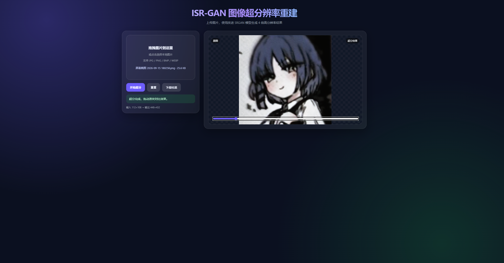

<div align="center">

# 🖼️ ISR-GAN-System

**基于改进 SRGAN 的图像超分辨率重建系统**

从低分辨率图像恢复出具有丰富纹理细节的高分辨率图像

[](https://www.python.org/)
[](https://pytorch.org/)
[](https://flask.palletsprojects.com/)
[](https://opencv.org/)
[](#-license)


</div>

---

## 📖 目录

- [✨ 项目简介](#-项目简介)
- [🚀 算法改进](#-算法改进)
- [📊 实验结果](#-实验结果)
- [🗂️ 项目结构](#️-项目结构)
- [⚙️ 环境安装](#️-环境安装)
- [📦 数据准备](#-数据准备)
- [🏋️ 训练流程](#️-训练流程)
- [🖥️ 运行 Web Demo](#️-运行-web-demo)
- [💾 模型权重说明](#-模型权重说明)
- [🎨 界面预览](#-界面预览)
- [🧰 技术栈](#-技术栈)
- [📄 License](#-license)

---

## ✨ 项目简介

图像超分辨率重建是计算机视觉领域的一项经典任务，旨在从低分辨率图像恢复出高分辨率图像，广泛应用于医疗影像、卫星遥感、安防监控等场景。

传统插值方法（如双三次插值）虽然算法简单、速度快，但**无法生成新的高频细节**，重建图像边缘模糊、纹理失真。近年来，以 SRGAN 为代表的生成对抗网络能够通过学习 LR→HR 的非线性映射生成视觉上更真实的图像。

本项目以 SRGAN 为基线，针对以下问题进行了针对性改进：

- ❌ 模型参数量大，难以在普通设备上快速部署
- ❌ GAN 训练不稳定，容易模式崩溃
- ❌ 单一 MSE 损失导致重建图像过于平滑，缺乏高频纹理

最终构建了一个**功能完备、交互友好**的超分辨率重建演示系统。

---

## 🚀 算法改进

### 1️⃣ 生成器网络：轻量化残差密集块

在残差块的基础上增加密集连接，允许网络每一层的输出作为后续所有层的输入。同时引入**简化通道注意力（SCA）**模块，以更少的参数量实现特征重用和融合，缓解深层网络的梯度消失问题。

| 参数 | 值 |
|---|---|
| 残差密集块数量 | **4** |
| 特征通道数 | **64** |
| 内部增长通道 | **32** |
| 上采样方式 | 两次 `PixelShuffle(2)`，共 4 倍 |

### 2️⃣ 判别器网络：条件判别器

采用 4 通道输入（RGB + 语义掩码）的条件判别器，通过 5 层卷积逐级下采样，最后经全局平均池化与全连接层输出真伪概率。

### 3️⃣ 复合损失函数

总损失由三部分加权构成：

$$
\mathcal{L}_{\text{total}} = \lambda_{\text{mse}} \cdot \mathcal{L}_{\text{MSE}} + \lambda_{\text{adv}} \cdot \mathcal{L}_{\text{Adv}} + \lambda_{\text{percep}} \cdot \mathcal{L}_{\text{Percep}}
$$

| 损失项 | 作用 | 权重 |
|---|---|---|
| 🎯 MSE 损失 | 监督像素级一致性，保证基础保真度 | `λ_mse = 1.0` |
| ⚔️ 对抗损失 | 采用非饱和损失，驱动生成器生成真实高频纹理 | `λ_adv = 1e-3` |
| 👁️ 感知损失 | 基于预训练 VGG19 特征图欧氏距离，约束全局语义 | `λ_percep = 1e-2` |

### 4️⃣ 两阶段训练策略

```
第一阶段 ──▶ 仅用 MSE 损失预训练生成器 50 epoch
                │
                ▼
第二阶段 ──▶ 加载预训练权重，引入判别器
           使用复合损失进行 20 epoch 联合对抗训练
```

### 5️⃣ 数据预处理

- ✅ 对 DIV2K 数据集做完整性检查与清洗
- ✅ 滑动窗口裁剪成 256×256 HR patch，双三次下采样生成 64×64 LR patch
- ✅ 在线数据增强：随机水平翻转、垂直翻转、90° 旋转
- ✅ 像素归一化到 `[-1, 1]`

---

## 📊 实验结果

在 DIV2K 验证集（约 1800 对图像块）上的客观指标对比：

| 方法 | PSNR (dB) ↑ | SSIM ↑ |
|---|---:|---:|
| 🔵 双三次插值 | 28.53 | 0.810 |
| 🟠 基线 GAN 模型 | 29.01 | 0.845 |
| 🟢 **本项目的改进模型** | **29.85** | **0.876** |

**主观效果对比**：

| 方法 | 效果描述 |
|---|---|
| 🔵 双三次插值 | 图像整体平滑，边缘和纹理模糊，缺乏真实感 |
| 🟠 基线 GAN | 边缘锐度有所提升，但存在不自然伪影 |
| 🟢 **改进模型** | 纹理细节更丰富，边缘更清晰，复合损失有效帮助生成器学习真实图像分布 |

---

## 🗂️ 项目结构

```
ISR-GAN-System/
├── 📄 config.py                     # 全局配置
├── 🚀 run.py                        # 一键启动脚本
├── 📋 requirements.txt              # 依赖列表
├── 📖 README.md
├── 🚫 .gitignore
├── 🖼️ img.png                       # README 预览图
│
├── 📁 src/
│   ├── 🧠 models/
│   │   ├── generator.py             # 生成器网络
│   │   └── discriminator.py         # 条件判别器
│   ├── 📊 data/
│   │   ├── preprocess.py            # 数据预处理
│   │   └── dataset.py               # 训练数据加载
│   ├── 📉 losses/
│   │   └── losses.py                # 复合损失函数
│   └── 🏋️ train/
│       ├── train_generator.py       # MSE 预训练
│       └── train_gan.py             # GAN 联合训练
│
├── 🌐 backend/
│   ├── app.py                       # Flask 主程序
│   ├── model_loader.py              # 模型加载
│   └── utils.py                     # 图像预处理/后处理
│
├── 🎨 frontend/
│   └── index.html                   # Web 演示页面
│
├── 💾 checkpoints/                  # 模型权重（.pth）
├── 📦 dataset/                      # 原始数据集（需自行下载）
├── ⚙️ processed/                    # 预处理产物
└── 📝 logs/                         # 训练日志与损失曲线
```

---

## ⚙️ 环境安装

推荐使用 Python 3.9+ 和虚拟环境：

```bash
python -m venv .venv

# Windows
.venv\Scripts\activate

# Linux / macOS
source .venv/bin/activate

pip install -r requirements.txt
```

**`requirements.txt`**：

```txt
torch>=2.0
torchvision
Flask
flask-cors
opencv-python
numpy
Pillow
scikit-learn
matplotlib
tqdm
```

> ⚠️ 代码使用 `torch.amp.GradScaler("cuda")` 和 `torch.amp.autocast("cuda")`，需 **`torch >= 2.0`**。

---

## 📦 数据准备

下载 [DIV2K 数据集](https://data.vision.ee.ethz.ch/cvl/DIV2K/)，将高分辨率原图放到：

```
dataset/
├── DIV2K_train_HR/    # 800 张训练原图
└── DIV2K_valid_HR/    # 100 张验证原图
```

运行预处理脚本：

```bash
python -m src.data.preprocess
```

预处理完成后，`processed/` 目录下会生成：

```
processed/
├── train/{HR,LR}/    # 训练集图像块
├── val/{HR,LR}/      # 验证集图像块
├── test/{HR,LR}/     # 测试集图像块
├── train_index.json  # 训练集索引
├── val_index.json    # 验证集索引
└── test_index.json   # 测试集索引
```

---

## 🏋️ 训练流程

### 第一阶段：MSE 预训练

```bash
python -m src.train.train_generator
```

- 仅使用 MSE 损失，训练 **50** 个 epoch
- 每 10 个 epoch 保存一次中间权重
- 最终权重保存至 `checkpoints/generator_pretrain.pth`
- 损失曲线保存至 `logs/generator_pretrain_loss.png`

### 第二阶段：GAN 联合训练

```bash
python -m src.train.train_gan
```

- 加载 `checkpoints/generator_epoch20.pth` 作为起点
- 使用复合损失，训练 **20** 个 epoch
- 每 5 个 epoch 保存一次检查点
- 最终权重保存至 `checkpoints/generator_final.pth`
- **部署使用** `checkpoints/generator_gan_epoch20.pth`

---

## 🖥️ 运行 Web Demo

确保 `checkpoints/generator_gan_epoch20.pth` 已存在，然后执行：

```bash
python run.py
```

脚本会**自动打开浏览器**并访问：

```
http://127.0.0.1:5000
```

页面支持：

- 🖱️ 拖拽或点击上传图片
- ⚡ 一键超分，**4 倍放大**
- 🎚️ 原图 / 超分结果滑块对比
- 💾 结果下载

> 💡 后端会**自动把任意尺寸的输入调整到合理范围**（短边 ≥ 32，长边 ≤ 512，宽高对齐到 4 的倍数），所以你上传任何尺寸的图片都可以正常处理。

### 手动启动后端

```bash
python backend/app.py
```

**API 接口**：

| 路由 | 方法 | 说明 |
|---|---|---|
| `/` | GET | 前端页面 |
| `/health` | GET | 健康检查 |
| `/superres_base64` | POST | 上传图片，返回 base64 编码的超分结果 |

**请求示例**：

```bash
curl -X POST -F "image=@example.jpg" http://127.0.0.1:5000/superres_base64
```

**响应示例**：

```json
{
  "image_base64": "iVBORw0KGgo...",
  "input_size": [256, 256],
  "output_size": [1024, 1024]
}
```

---

## 💾 模型权重说明

本仓库已包含以下权重，**clone 后可直接运行**：

| 文件 | 大小 | 用途 |
|---|---|---|
| `checkpoints/generator_gan_epoch20.pth` | ~3.2 MB | 🟢 部署推理（推荐使用） |
| `checkpoints/generator_pretrain.pth` | ~3.2 MB | 🟡 MSE 预训练最终模型，可用于重新训练 |

> 📌 `discriminator_*.pth` 和中间检查点（`generator_epoch10/30/40/50`、`generator_gan_epoch5/10/15`）未上传，推理时不需要。

---

## 🎨 界面预览

**主界面**：



**使用步骤**：

1. 🖱️ 拖拽或点击上传本地图片
2. ⚡ 点击"开始超分"
3. ⏳ 等待数秒至数十秒（取决于设备）
4. 🎚️ 拖动滑块对比原图与超分结果
5. 💾 点击"下载结果"保存到本地

---

## 🧰 技术栈

| 类别 | 技术 |
|---|---|
| 🐍 编程语言 | Python 3.9+ |
| 🔥 深度学习框架 | PyTorch ≥ 2.0 |
| 👁️ 计算机视觉 | OpenCV, NumPy |
| 🌐 后端框架 | Flask |
| 🎨 前端 | 原生 HTML5 / CSS3 / JavaScript |
| 📊 数据处理 | scikit-learn, Pillow |
| 📈 可视化 | Matplotlib, tqdm |

---

## 📄 License

MIT

---

如果这个项目对你有帮助，欢迎 Star ⭐